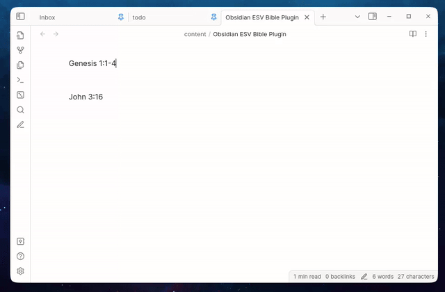

# Obsidian ESV Bible Plugin

An [Obsidian](https://obsidian.md) plugin generated with ChatGPT that inserts passages (and anglicises them) from the [English Standard Version](https://www.esv.org/) Bible directly into your Obsidian notes.

Here it is in action:

## Installation

1. Extract the latest release into your `<vault-directory>/.obsidian/plugins` directory.
1. Enable the plugin from the Obsidian settings menu.

## Usage

1. Obtain an API key from the [ESV API](https://api.esv.org/account/) website.
1. Configure your API key and other ESV API settings in the plugin settings tab.
1. Select a Bible verse reference in your note and run the "Insert Bible Verse" command.

